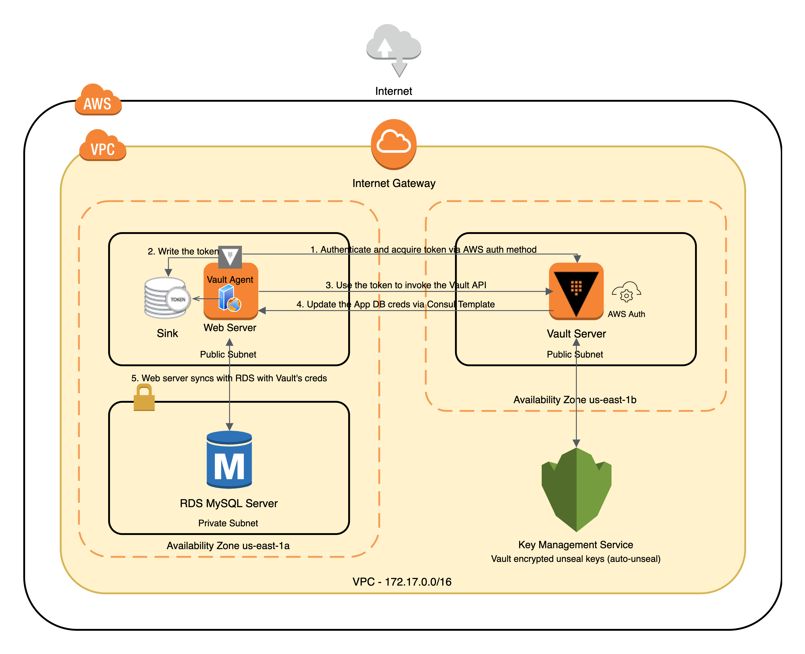

# Demo App for Datadog Integrations - The "Pet Clinic App"
## Getting Started
* Ensure you have a valid AWS account to deploy this demo app into
* Ensure that you have configure your account's access keys via `aws configure`, with `default` profile set up

## Prerequesites
* Terraform > 0.13. If you are using an older version of Terraform then you WILL receive an error. Download the [latest terraform here](https://releases.hashicorp.com/terraform/) and unzip it to your `$PATH`.
* A valid AWS account
* A valid Datadog account

## Demo App Diagram

## Hiring Challenge Steps
Check out steps in this [Google doc](https://docs.google.com/document/d/1SHB32jIYlDuvq609g4Uj24lQAnkAODj7DC0Vq4MU9vM/edit?usp=sharing)